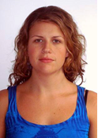

<!-- Professor, sei que não se usa colocar foto 3x4 em currículo atualmente.-->
<!--Coloquei apenas para incrementar o trabalho. -->

<!-- DOCTYPE html>							
<html>
	<head>
		<title> Trabalho P2 UVA - CV Fabíula Campos </title>
		<meta charset="utf-8"/>
		<!-- meta name="CV Fabíula Campos" content="Trabalho da disciplina "Desenvolvimento Web" para o segundo 			     	                   bimestre de 2018 do curso de Sistema de Informacao."/> 
		<meta name="author" content="Fabíula Campos"/>
		<link rel="stylesheet" type="text/css" href="CV/sobrecv.css"/>
		
		</head>
	<body>
		
		<h1>
 Fabíula Luiza Rezende Campos
 </h1>

		<figure>  
		 
			 
		</figure>

		<h5>Solteira, Nasc.: 24/01/1985</h5>
		<h5>Rua Almirante Tamandaré, 67/705. Flamengo, Rio de Janeiro - RJ</h5>
		<h5>CEP. 22250 040 - Cel. (21) 9.6557-6149</h5>
		<h5><a href="mailto:fabiularezende@yahoo.com.br" id="link">fabiularezende@yahoo.com.br</a></h5>
		
		<h3>Objetivo</h3>

		Atuar na área de tecnologia para têxteis.

		<h3><strong>Resumo de qualificações</strong></h3>

		Minha última experiência é no Curso Técnico de Produção de Moda/FAETEC na cidade do Rio de Janeiro. Entre os principais 		resultados alcançados destacam-se: regência em sala de aula com as disciplinas Materiais e Processamentos Têxteis, Gestão e 			Marketing e Vitrinismo. Atualmente leciono em três cursos diferentes no ramo da Moda.

		<h3><strong>Experiência Profissional</strong></h3>

		<h4>Setembro de 2017 à atual – FAETEC/PRONATEC/Rio de Janeiro</h4>

		Professora do Curso de Produção de Moda
		
		
<em>Principais atividades:</em>

		<ul>
			<li> Regência nas disciplinas Processamentos e Materiais Têxteis, Gestão e Marketing e Estamparia.
			<li> Desenvolvimento de projetos e trabalhos nas referidas matérias a fim de complementar a 				     grade curricular do curso. 
		</ul>
		
		<h4>Novembro de 2016 à atual – FAETEC/Rio de Janeiro</h4>

		Professora do Curso de Produção de Moda
		
		
<em>Principais atividades:</em>

		<ul>
			<li> Regência nas disciplinas Processamentos e Materiais Têxteis, Vitrinismo e Estamparia.
			<li> Desenvolvimento de projetos e trabalhos nas referidas matérias a fim de complementar a 				     grade curricular do curso. 
		</ul>
		
		<h4>Abril de 2018 à atual – ESCA/Rio de Janeiro</h4>

		Professora do Curso de Modelagem
		
		
<em>Principais atividades:</em>

		<ul>
			<li> Regência na matéria Modelagem em tecido plano no Curso Intensivo de Moda – Moda {IN}/ESCA.
			<li> Desenvolvimento de projetos e trabalhos nas referidas matérias a fim de complementar a 				     grade curricular do curso. 
		</ul>
		
		<h4>Novembro de 2015 a Novembro de 2016 - FAETEC/Duque de Caxias</h4>

		Coordenadora Técnica do Curso de Modelagem do Vestuário

		
<em>Principais atividades:</em>

		<ul>
			<li> Oferecer condições para que os professores trabalhem coletivamente as propostas 				    			 	     curriculares em função de sua realidade. 
			<li> Oferecer condições ao professor para que se aprofunde em sua área específica e trabalhe 				     bem com ela.
			<li> Desenvolvimento de ações para atingir objetivos e metas comuns da escola/professor/aluno.
			<li> Elaboração/adaptação às necessidades e objetivos da escola, possibilitando novos 				  	                       significados atribuídos à prática educativa da escola e à prática pedagógica dos professores. 
		</ul>
		
		<h4>Fevereiro de 2014 Novembro de 2016 – FAETEC/Duque de Caxias</h4>

		Professora de Modelagem do Vestuário

		
<em>Principais atividades:</em>

		<ul>
			<li> Regência nas matérias de Modelagem Feminina em Tecido Plano, Modelagem Feminina em 			   	                        Malharia, Modelagem Infantil e Modelagem Moda íntima no Curso Técnico de Modelagem do 				     Vestuário. 
			<li> Desenvolvimento de projetos e trabalhos nas referidas matérias a fim de complementar a 				     grade curricular do curso.
		</ul>
		
		<h4>Novembro de 2014 a Julho de 2016 – FAETEC/PRONATEC/Duque de Caxias</h4>

		Professora de Modelagem do Vestuário/Design de moda

		
<em>Principais atividades:</em>

		<ul>
			<li> Regência nas matérias de Modelagem Feminina, Modelagem Infantil e Design de Moda 				   	                        (desenvolvimento de coleção) no Curso Técnico de Modelagem do Vestuário/PRONATEC.
			</li> Desenvolvimento de projetos e trabalhos nas referidas matérias a fim de complementar a 				      grade curricular do curso.
		</ul>
		

		<h4>Janeiro de 2016 à Maio de 2016 – ESCA/Rio de Janeiro</h4>

		Professora de Design de Moda

		
<em>Principais atividades:</em>

		<ul>
			<li> Regência na matéria História da Moda no Curso Intensivo de Moda – Moda {IN}/ESCA.
			<li> Orientação de trabalho final dos alunos na referida matéria.
		</ul>
		<h4>Março de 2012 à Janeiro de 2014 – Itajubá-MG</h4>

		Estilista e proprietária da marca Rosalina

		
<em>Principais atividades:</em>

		<ul> 
			<li> Compras de materiais, desenvolvimento de coleções, atendimento a fornecedores, marketing 				via redes sociais, vendas no E-commerce.
		</ul>
		<h4>Novembro de 2010 à março de 2012 – Itajubá-MG</h4>

		Estilista da marca Clara Assis

		
<em>Principais atividades:</em>

		<ul>
			<li> Compras de materiais, desenvolvimento de coleções, atendimento a fornecedores.
		</ul>
		<h3><strong>Formação Profissional</strong></h3>
		<ul>
			<li> Graduação em Sistema de Informação - Universidade Veiga de Almeida (Inicio em Mar 2018). 
			<li> Pós graduação em Orientação Educacional – Universidade Cândido Mendes, Rio de Janeiro 				     (Dez 2017).
			<li> Pós graduação em Licenciatura Plena em Artes – Faculdade Polis das Artes, São Paulo (Jan 				     2016).
			<li> Graduação em Design de Moda – Universidade Veiga de Almeida – Rio de Janeiro (Dez 2010).
		</ul>
		<h3><strong>Idiomas:</strong></h3>
		<ul>
			<li> Inglês (nível básico).
		</ul>
		<h3><strong>Formação Complementar:</strong></h3>
		<ul>
			<li> Curso Tecnologia e Moda - Templo MALHA, Rio de Janeiro (Maio 2018)
			<li> Curso de serigrafia – SESC, Rio de Janeiro (Dez 2016).
			<li> Estágio Regência em Artes no Ensino Fundamental e Médio - Colégio Duque, Duque de Caxias 				     (Dez 2015).
			<li> Curso de Modelagem Feminina – SESI, Itajubá (Julho 2012).
			<li> Estágio Costura e Adereços de Carnaval – Barracão de Samba São Clemente, Rio de Janeiro 				     (Fev 2008).
			<li> Curso de Corte e Costura – Universidade Veiga de Almeida, Rio de Janeiro (Dez 2007).
		</ul>
	    <h3><strong>Informática:</strong></h3>

		

		
	Pleno domínio em Windows, Word, Power Point e Internet.
		 
		 

		<footer>
			F a b í u l a   L u i z a   R e z e n d e   C a m p o s.
		</footer>
	</body>
</html>

